## Advanced Lane Finding Report

The goal of this project is to create a frame processing pipeline that can detect and mark lane boundaries in a video. 
The pipeline implemented consists of the following steps (extracted from Udacity's project description):

* Compute the camera calibration matrix and distortion coefficients given a set of chessboard images.
* Apply a distortion correction to raw images.
* Use color transforms, gradients, etc., to create a thresholded binary image.
* Apply a perspective transform to rectify binary image ("birds-eye view").
* Detect lane pixels and fit to find the lane boundary.
* Determine the curvature of the lane and vehicle position with respect to center.
* Warp the detected lane boundaries back onto the original image.
* Output visual display of the lane boundaries and numerical estimation of lane curvature and vehicle position.

### Camera Calibration:
The first step in the project is to calibrate the camera embedded in the car. The purpose of the calibration is to 
correct the distortions that are introduced by the camera lens. The method used in this project is to use pictures of a 
chessboard taken with the camera to calibrate its parameters.

The calibration set used in this project consists of 20 chessboard pictures. Below is an input image example for 
calibration:
 
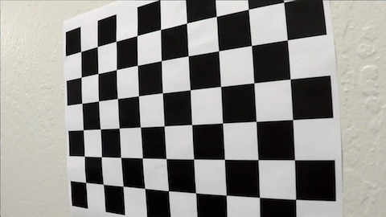

And below is the undistorted calibrated image created using the camera matrix and distortion coefficients:

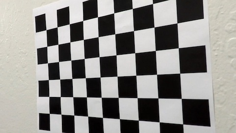
 
The camera calibration step is implemented in the file camera_calibration.py

### Correcting distortion on video frames:
Once we have calculated the camera matrix and distortion coefficients we can proceed to correct the video frames from 
the road. This is the first step in the lane detection pipeline. In order to correctly identify lane markers we need to have
an undistorted view of the road.
Here is an example of an original camera image from the road and its corresponding undistorted image:

* Original:

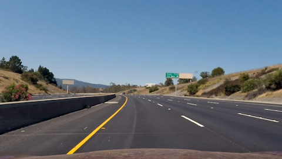

* Undistorted:

The frame undistortion is implemented in LaneLinePipeline::process_image. It receives as parameter the calibration
 parameters calculated in camera_calibration.py and undistort each video frame.

### Creating threshold binary images:
The next step consists of creating a binary image of the undistorted image. We use the following image processing masks and filters
to create the binary image:

* White and Yellow: transforms image from RGB to HSV and create a mask that retains only yellow and white colors.
* Saturation: uses the saturation channel of HLS color space to create binary image.
* Sobel: create binary image using Sobel filters X, Y, Magnitude and Direction and corresponding thresholds.

The method LaneLinePipeline::threshold_combinations creates the threshold binary images used for lane detection. The method
returns multiple images in case the first method fails to find lanes. It also uses a region of interest for creating the binary
images, clipping regions that are not part of the road.

Below is an example of threshold binary images. The combined image is the first candidate used for detecting lane lines:

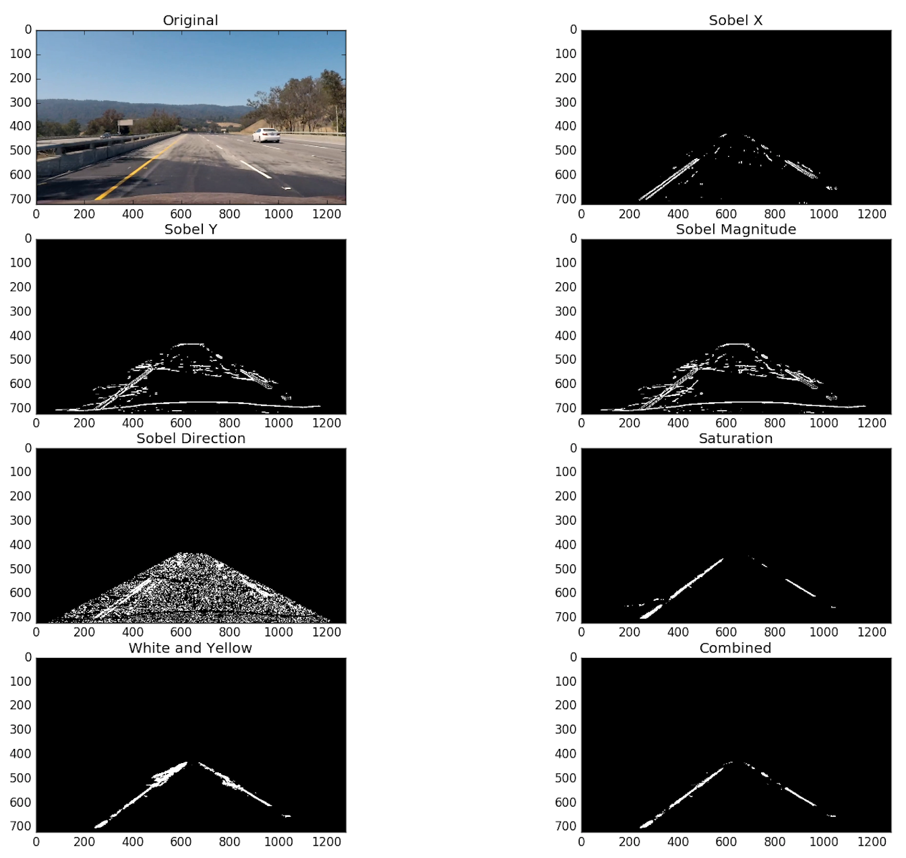

### Perspective Transform Birds-Eye View:
The following step in the pipeline consists of transforming the binary image to "Birds-Eye View":

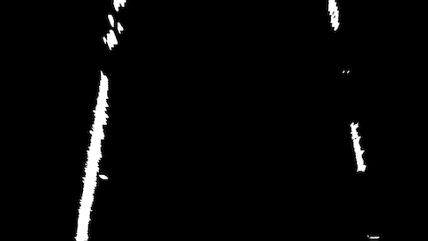

The input for the birds eye view transformation is a set of points in the source image and where they should be
in the target (transformed) image. The birds eye view transformation is implemented in frame_processing.py method
birds_eye_matrix_road.

### Detecting Lane Pixels:
The next step in the pipeline consists of detecting (x,y) pixels that are part of the lane lines. We use 2 different
methods to detect the points: histogram and iterative. The algorithm implemented in this project uses the iterative method
when there a previous lane is available, but it also checks if the values are compatible with the lanes from the previous frame.
It falls back to the histogram method when the current frame lanes deviates too much from the previous frame lanes.

#### Histogram Method
The histogram method uses a histogram of 1 pixels in a given column of the lower half part of the image, using the peaks
in the histogram as starting X coordinates for tracing left and right lanes. A search window is applied centered in the
X coordinates and iteratively moved in the Y axis to detect more points that are part of the lane.
Below is a sample histogram:

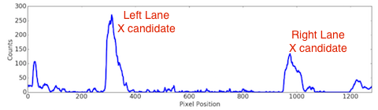

And here are the lane pixels (marked in red, green is the window) detected for left and right images using the
histogram method:

* Histogram Left Lane Pixels:

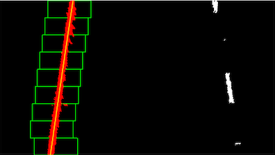

* Histogram Right Lane Pixels:

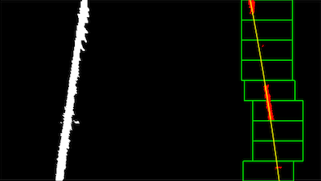

The histogram lane pixel detection is implemented in LaneLinePipeline::get_histogram_lanes_xy method.

#### Iterative Method
The iterative method uses a the lane fit from a previous frame in the video as candidate region for detecting pixels
belonging to a lane line. The example below shows iterative lane lines detected using previous lines as search regions,
marked in green:

* Iterative Left Lane Pixels:

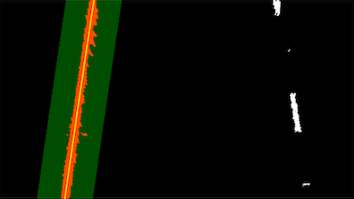

* Iterative Right Lane Pixels:

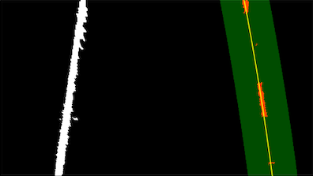

The iterative lane pixel detection is implemented in LaneLinePipeline::get_iterative_lanes_xy method.

### Marking Lanes, Radius of Curvature and Car Offset:
The lane fit is calculated using a second order polynomial fit using the x and y values detected in the previous step. 

The lanes are marked in the warped image, the method is implemented in LaneLinePipeline::mark_lanes. This method also warps 
the lane markers using an inverse matrix transform from birds-eye view back to the original view.

We also compute the radius of curvature and car offset from the center of the lane. 
The lane fit and radius of curvature are implemented in LaneLine.py. 
The offset is computed in LaneLinePipeline::lane_offset.

* Video Frame with Radius of Curvature and Lane Offset Marked:
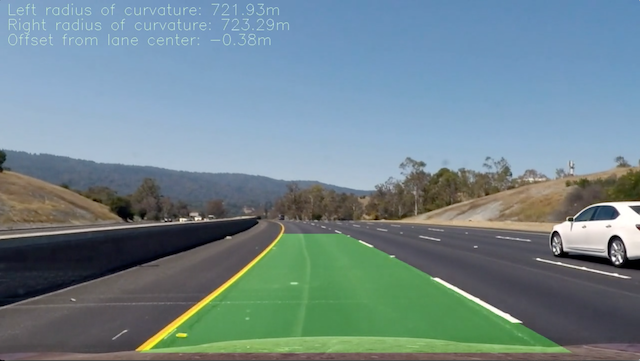

### Conclusion
The implementation of the pipeline works very well with the project video. The challenge video required more work and 
tuning of the parameters, together with a more robust accept/reject of lane fit candidates. The links below show the
videos with marked lane lines for the project_video and the challenge_video. 

* Project Video:

* Challenge Video:

